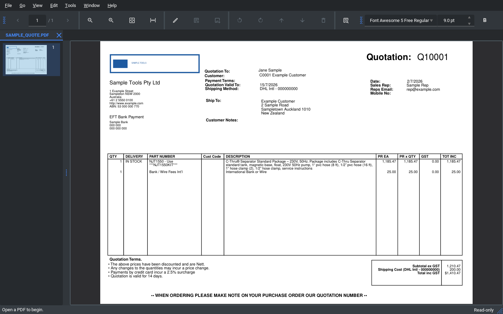
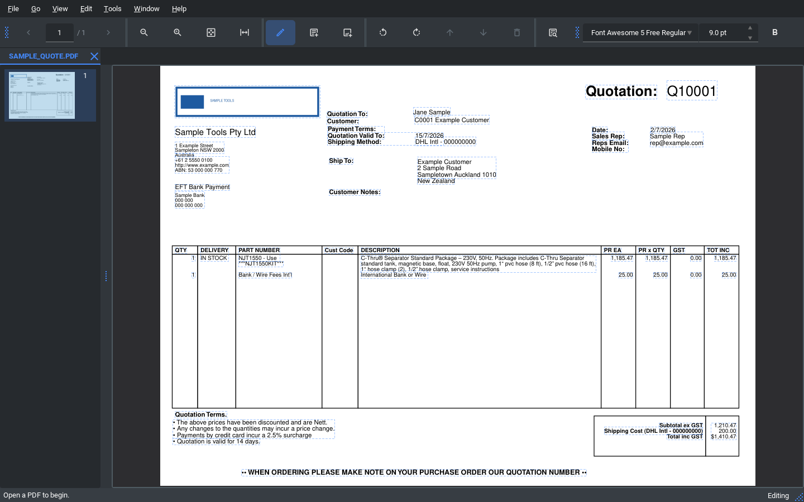
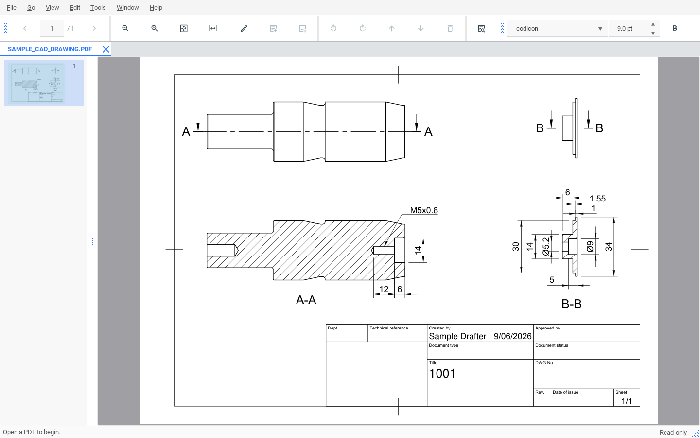

# PDF Editor — free, open-source PDF viewer & editor for Windows

**PDF Editor is a free, open-source PDF viewer and editor for Windows.** View and
navigate PDFs, edit text and images directly on the page, OCR scanned documents,
merge / split / reorder pages, add highlights and comments, and print — in a fast,
themed desktop app that runs fully offline. No account, no subscription, no cloud.


[](../../releases/latest)
[](../../actions/workflows/ci.yml)
[](LICENSE)


Built with Python 3.13, **PyMuPDF** (PDF engine), **PySide6** (GUI), themed with
**qt-material** (Material dark/light) and **QtAwesome** icons, packaged with
**PyInstaller**. Contributor-facing design notes are in
[ARCHITECTURE.md](ARCHITECTURE.md).

> **Just want to run it?** Grab a prebuilt Windows build from the
> [**Releases**](../../releases) page — no build step required. Two options:
> the **installer** (`pdf-editor-setup-<version>.exe`, see
> [Install](#install-windows-setup-installer)) or the **portable ZIP**
> (`pdf-editor-portable-<version>.zip` — no install, see
> [Portable](#portable-no-install)).

## Screenshots

| Viewer (dark theme) | Editing text & images in place |
|---|---|
|  |  |



## Architecture in one line

`src/pdfcore/` is a headless engine (pure Python + PyMuPDF, **no Qt**);
`src/pdfapp/` is a thin PySide6 UI that imports `pdfcore` and renders. The engine
is fully testable with pytest, no GUI required.

## Features

**Viewer:** open PDFs (incl. password-protected) in tabs, render pages, navigate,
zoom (fit-page / fit-width / ±, Ctrl+wheel), a thumbnail sidebar, and print
(colour/BW, paper size, per-page orientation, preview). Saving a
password-protected file **keeps its protection**.

**Password protection:** File → Protect document… sets a password to **open**
the document (real AES-256 encryption) and/or a permissions password that
**restricts editing and printing** — Acrobat's standard options: printing
on/off, five "changes allowed" levels (none / page ops / form fill & sign /
commenting / anything except extraction), and a copy toggle. The app also
*honours* restrictions on files it opens: restricted actions are disabled, and
entering Edit mode asks for the permissions password. Honest caveat: the open
password is real cryptography; the permission flags bind well-behaved PDF
readers (like this one) but are not a security boundary.

**Page manipulation:** rotate, delete, reorder (move up/down), insert pages from
another file, merge several PDFs, split into ranges — plus Save / Save As with an
atomic save-over-the-open-file.

**Content editing:** documents open **read-only** — flip the Edit mode toggle
(pencil, Ctrl+E) to make a document editable; the status bar always shows which
mode you're in. In edit mode, everything editable is outlined by default
("Show editable areas" — toggle it off for a cleaner view), and hovering shows
the details (outline + cursor, with the exact gestures named in the status
bar). Click text or an image to select it — drag the selection to move it,
drag an image's corner handle to resize, press Delete to remove a selected
image. Double-click text to edit the whole paragraph in place —
Ctrl+double-click edits just one line, and a toolbar toggle swaps those
defaults (Enter / Ctrl+Enter commits, Esc cancels).
A style toolbar sets font, size, colour, bold / italic / underline and
super/subscript — per selection, down to a single character. Right-click
anything for the same actions as menus: edit, highlight, replace/delete an
image, or insert text/images exactly where you clicked. Every edit is
undoable — snapshot-based undo/redo per document — and Help → "Editing
gestures" lists every interaction.

| Action | Shortcut | Action | Shortcut |
|---|---|---|---|
| Open | Ctrl+O | Rotate CW / CCW | Ctrl+R / Ctrl+Shift+R |
| Save / Save As | Ctrl+S / Ctrl+Shift+S | Move page up / down | Ctrl+Shift+↑ / ↓ |
| Next / Prev page | PgDn / PgUp | Delete page | Ctrl+Delete |
| First / Last page | Ctrl+Home / End | Fit page / width | Ctrl+0 / Ctrl+1 |
| Zoom in / out | Ctrl+= / Ctrl+- | Print | Ctrl+P |
| Undo / Redo | Ctrl+Z / Ctrl+Y | Edit mode | Ctrl+E |

**Digital signing:** real cryptographic signatures via
[pyHanko](https://github.com/MatthiasValvekens/pyHanko), from the **Sign**
menu — drag where the signature should appear (your signature image becomes
the stamp over a real signature) or sign without a visible stamp; sign with
your own PKCS#12 (.p12/.pfx) certificate, or generate a self-signed one for
tamper-evidence. A signature library stores the people you're authorised to
sign for (signature + initials images, optional per-person certificate —
passwords are never stored), and "Place initials…" stamps their initials on
pages before you sign. The signed copy is saved as a **new** file and opened
in its own tab. Signing is the **final** step: the signature is appended to
the finished file, and any further edit invalidates it (that's how PDF
signatures work — tamper-evidence is the point). Signing an already-signed
document appends — every earlier signature stays valid — and signing *edited*
signed content is refused rather than silently breaking the signatures.
Self-signed signatures show as "unknown/untrusted" in readers until the
recipient trusts the certificate — they prove the document hasn't changed,
not who you are. Opening a signed document shows its status in a banner across the top of
the view (Sign → Signature status… for details) — intact is dismissable, but
a **tampered** signed file gets a permanent red banner that stays for the
life of the tab, just like Acrobat. Entering Edit mode on a signed document
warns you first, and saving an edited signed document **removes** its
signatures with your consent (offering Save As… so the signed original
survives) — an edited file is honestly unsigned rather than carrying broken
signatures that readers flag as tampering.

Full text reflow and form filling are out of scope.

**Search & Extract Text:** find text across the document (Ctrl+F) and Tools →
Extract text. Both work on normal PDFs and, for pages with **no text layer**
(scans, or text exported as vector outlines), fall back to OCR — pages are OCR'd
into word boxes with confidences on demand. These are read-only features; no OCR
text layer is written back into the document. OCR requires a local Tesseract
install in development (see Setup); packaged builds bundle it.

**Sample documents:** the [`samples/`](samples/) folder ships three fabricated
sample PDFs to try features on — a quote (text layer, for editing), a CAD drawing
(vector text), and a no-text-layer invoice (for OCR / Extract Text). They contain
no real data.

## Why PDF Editor?

- **Free and open-source** (AGPL-3.0) — no licence fees, no subscription, no account.
- **Fully offline and private** — everything happens on your machine; nothing is
  uploaded to a cloud service, unlike browser-based PDF tools.
- **Real in-place editing** — change existing PDF **text and images** on the page,
  not just add annotations on top.
- **Built-in OCR** — read and search **scanned or image-only PDFs** with a bundled
  Tesseract engine.
- **Fast native desktop app** — powered by PyMuPDF, with a modern dark/light UI.

Scope note: this is a focused viewer/editor, not a full Adobe Acrobat replacement —
form filling and full text reflow are intentionally out of scope.

## FAQ

**Is PDF Editor free?**
Yes — it's free and open-source under the AGPL-3.0 licence. There is no paid tier.

**Does it work offline?**
Yes. It's a desktop application that runs entirely on your computer. No PDF is ever
uploaded anywhere, which makes it a good fit for confidential documents.

**Which operating systems are supported?**
Windows (x64) — that's what the installer targets. The code is Python/PySide6, so
building from source on other platforms may work, but only Windows is packaged and
tested.

**Can it edit the text in an existing PDF?**
Yes. In edit mode you click text to edit it in place (single line or a whole
paragraph), and you can move, resize, replace, or delete images too.

**Can it read scanned PDFs / PDFs with no text layer?**
Yes. It has built-in OCR (a bundled Tesseract engine) so you can search and extract
text from scanned or outlined-text documents.

**Can it merge, split, or reorder pages?**
Yes — merge several PDFs, split into page ranges, and rotate / delete / reorder /
insert pages.

**How do I make it my default PDF viewer on Windows?**
See [Set PDF Editor as your default PDF viewer](#set-pdf-editor-as-your-default-pdf-viewer).

**Is it a replacement for Adobe Acrobat?**
It covers everyday viewing, editing, page organisation, printing, OCR,
cryptographic digital signing (Sign menu), and password protection with
Acrobat-style permission restrictions (File → Protect document…). It does
**not** do AcroForm filling or full document reflow.

## Setup (Windows, PowerShell)

```powershell
python -m venv .venv
.\.venv\Scripts\Activate.ps1
pip install -e ".[dev]"

# Optional — OCR features and their tests (tests skip without it):
winget install -e --id UB-Mannheim.TesseractOCR
```

The Tesseract binary and its `tessdata` models are **not** Python packages —
in development they come from the install above; packaged builds bundle them
as application assets.

## Run

```powershell
python -m pdfapp
```

## Test

```powershell
.\scripts\test.ps1      # pytest
.\scripts\lint.ps1      # ruff check + ruff format --check
```

## Package (standalone Windows build)

```powershell
.\scripts\package.ps1   # PyInstaller one-folder build -> dist\pdf-editor\ (+ .zip)
```

This produces a one-folder bundle (`dist\pdf-editor\`) containing `pdf-editor.exe`
and its dependencies, including the Tesseract OCR runtime (staged automatically
from the local install — the Setup step above is required to build). It also
zips that bundle into the portable distribution
`dist\pdf-editor-portable-<version>.zip` (see [Portable](#portable-no-install)).
The build is unsigned, so on first launch Windows SmartScreen may show "Windows
protected your PC" — click **More info → Run anyway**.

## Portable (no install)

Prefer not to install anything? Download `pdf-editor-portable-<version>.zip` from
the [**Releases**](../../releases) page, extract it anywhere (a folder, a USB
stick), and run `pdf-editor.exe` inside the extracted `pdf-editor\` folder. No
installer, no admin, no registry changes.

The portable build is **self-contained**: it keeps its diagnostics log in a
`data\` folder next to the exe rather than in your user profile, so it leaves
nothing behind on the host machine. OCR is bundled just like the installed
build, and it's still single-instance (opening a second PDF reuses the running
window). Being unsigned, it triggers the same SmartScreen "More info → Run
anyway" on first launch. To make double-clicking PDFs open this copy, use the
[installer](#install-windows-setup-installer) instead — the portable build
deliberately registers nothing.

## Install (Windows setup installer)

**Easiest — download a prebuilt installer.** Go to the
[**Releases**](../../releases) page and download `pdf-editor-setup-<version>.exe`.
Running it installs **per user** (to `%LOCALAPPDATA%\Programs\PDF Editor`, **no
admin / UAC prompt**), adds a Start-menu shortcut, and registers PDF Editor as an
available PDF handler. The installer is **unsigned**, so Windows SmartScreen may
show "Windows protected your PC" on first run — click **More info → Run anyway**.
To make double-click open PDFs in it, see
[Set as default](#set-pdf-editor-as-your-default-pdf-viewer). Uninstall from
**Settings → Apps → Installed apps** (removes the app and all its registry keys).

### Build the installer yourself

To build the setup `.exe` from source instead, you need
[Inno Setup](https://jrsoftware.org/isinfo.php) once:

```powershell
winget install -e --id JRSoftware.InnoSetup   # one-time; provides the compiler
```

> **Inno Setup licensing:** version 6.5+ prints a "Non-commercial use only"
> compiler banner and *requests* (does not require) commercial users to buy a
> [licence](https://jrsoftware.org/isorder.php) — its open-source licence still
> permits internal/commercial use. Version 6.4.3 is the last banner-free release.
> The banner is compiler-console only; it never appears in the produced installer.

Then build the bundle and wrap it into a setup installer:

```powershell
.\scripts\package.ps1          # PyInstaller onedir -> dist\pdf-editor\
.\scripts\build_installer.ps1  # -> dist\pdf-editor-setup-<version>.exe
```

Run the resulting `dist\pdf-editor-setup-<version>.exe`. It installs **per user**
(to `%LOCALAPPDATA%\Programs\PDF Editor`, **no admin / UAC prompt**), adds a
Start-menu shortcut, and registers PDF Editor as an available PDF handler. Being
unsigned, the setup triggers the same SmartScreen "More info → Run anyway" as the
raw exe. Re-running a newer installer **upgrades in place** — one install, no
duplicate shortcut, old files removed. Uninstall from **Settings → Apps →
Installed apps** (it removes the app and all its registry keys).

### Making a release

Bump `version` in `pyproject.toml` (the single source of truth), then build both
artifacts and attach **both** to the GitHub Release:

```powershell
.\scripts\package.ps1          # -> dist\pdf-editor\  +  dist\pdf-editor-portable-<version>.zip
.\scripts\build_installer.ps1  # -> dist\pdf-editor-setup-<version>.exe
```

Upload `dist\pdf-editor-portable-<version>.zip` **and**
`dist\pdf-editor-setup-<version>.exe` to the release so every release ships both
the portable and installer builds. `package.ps1` versions the zip and drops the
portable marker into it automatically; the installer bundle stays marker-free.

### Set PDF Editor as your default PDF viewer

Windows 10/11 do **not** let an app make itself the default PDF handler — that's
a deliberate anti-hijacking rule, so the installer can only *register* the app,
never seize the default. To make double-click open PDF Editor, choose it
yourself: the installer's final screen has a **"Set PDF Editor as the default PDF
app"** checkbox that deep-links to Windows Settings, or open **Settings → Apps →
Default apps**, find **PDF Editor** (or `.pdf`), and pick it. Until you do,
Explorer keeps showing the current default app's icon on `.pdf` files; PDF
Editor's distinct document icon (separate from the app icon) appears on them
only once PDF Editor is the chosen default.

Once set, double-clicking a PDF (or right-click → **Open with → PDF Editor**)
opens it directly in the app. PDF Editor is single-instance: if it's already
open, the file appears as a **new tab** in the existing window rather than
launching a second copy.

## Licensing (AGPL-3.0)

This app bundles **PyMuPDF**, which is licensed under the GNU **AGPL-3.0**.
Because AGPL-3.0 is copyleft, **the combined work is distributed under AGPL-3.0**
(see [LICENSE](LICENSE)) — and any fork or redistribution inherits the same
licence. If you distribute a binary of this app (or a derivative), you must make
the complete corresponding source available to your recipients under AGPL-3.0.
For binaries released from this project, **that corresponding source is this
repository.**

It also bundles **PySide6** (LGPL-3.0), **qt-material** (BSD-2-Clause, + the
bundled Roboto font, Apache-2.0), **QtAwesome** (MIT, + Material Design Icons,
Apache-2.0), and **Jinja2** (BSD-3-Clause), plus — for OCR — **pytesseract**
(Apache-2.0) and **Pillow** (MIT-CMU), which drive the external **Tesseract OCR**
engine (Apache-2.0) shipped as a bundled asset in packaged builds. Digital
signing brings **pyHanko** (MIT) and **cryptography** (Apache-2.0 OR
BSD-3-Clause) with their dependency stack. Full third-party attribution and
licences are in [NOTICE](NOTICE).

This is a desktop application, not a network service, so the AGPL's section 13
network-interaction clause is not triggered; the standard copyleft obligations of
AGPL-3.0 still apply to distribution.
